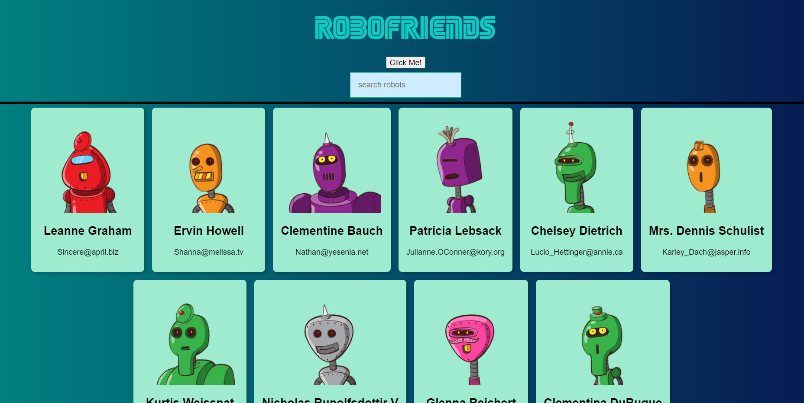
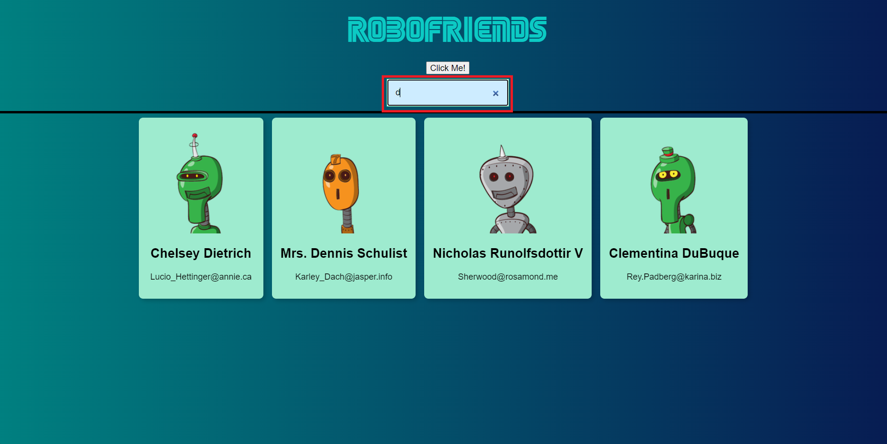

# 🚀 RoboFriends - Your Interactive Robot Companions

Welcome to RoboFriends, where the future meets friendship! 🤖✨ This React-powered application brings a squad of quirky robots to life, ready to be your digital buddies. Harnessing the power of [JSONPlaceholder](https://jsonplaceholder.typicode.com/users), RoboFriends not only showcases the magic of React but also makes connecting with robots an exhilarating experience.
📸 Screenshots



## 🌈 Features That Make RoboFriends Shine

- **Dynamic Search:** Seamlessly find your robotic pals by typing their names into our interactive search bar.
- **Responsive Design:** Whether you're on a desktop or a mobile device, RoboFriends adapts to provide a seamless experience.
- **Loading Excitement:** Witness the loading indicator as RoboFriends fetches the latest robot data – it's like unwrapping a gift!

## 🚀 Quick Start in 4 Easy Steps

1. **Clone this Repository:**

    ```bash
    git clone https://github.com/your-username/robofriends.git
    cd robofriends
    npm install
    npm start
The application should now be running at http://localhost:3000.

✨ Features
Bot Companions: Explore a vibrant list of friendly robots.
Smart Search: Easily find your robotic pals by searching for their names.
Responsive Design: Whether you're on a desktop or a mobile device, RoboFriends adapts seamlessly.
Loading Indicator: Witness the excitement with a dynamic loading indicator during data retrieval.

🛠 Technologies Used
React
React DOM
React Scripts
Tachyons
